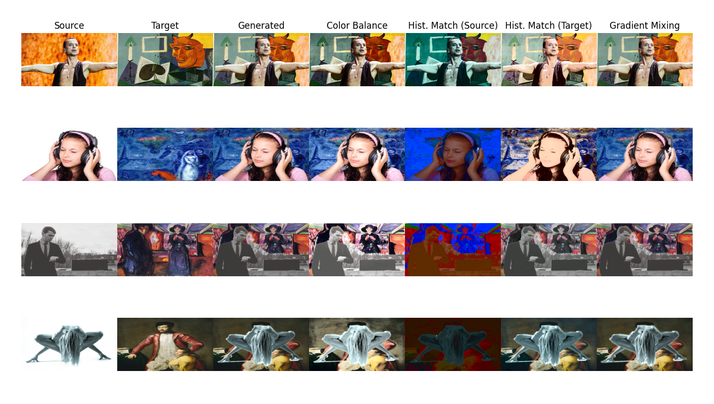

# BackSub CV
> Background Substitution using Python's OpenCV



### Quick Usage

Install requirements.

```shell
pip install -r requirements.txt
```

Experimentation may include the use of your own dataset. For verification, use the [Supervisely Segmentation Sample Dataset](https://drive.google.com/file/d/1biTZkShX_LxtIuuEKTV_mbyuUd-23oD6/view?usp=sharing)
and the [WikiArt Dataset](https://www.kaggle.com/datasets/ikarus777/best-artworks-of-all-time).

#### Run Single Task

Run Single Backgorund Substitution Task on an Image and a desired Backgorund

```shell
python3 run.py <model> <image_file> <background_file> --blend_mode=<blend>
```
- model : Model of Image Segmentation ('contourmask', 'grabcut', 'watershed')
- image_file : Path to Image File (image.png)
- background_file : Path to Substitute Background File (background.png)
- (Optional) blend_mode : Image Blending Mode ( "gradient_mix", "balance", "hist_match_s", "hist_match_t", "none")
- (Optional) file_out : Output File (result.png)

#### Run Evaluation of Model

Run an evaluation of the model for IoU and Pixel Accuracy metric

```shell
python3 run.py <model> <image_path> <mask_path> <background_path>
```
- model : Model of Image Segmentation ('contourmask', 'grabcut', 'watershed')
- image_path : Path to Images (images/)
- mask_path : Path to Ground Truth Masks (masks/)
- backgorund_file : Path to Substitute Background (background.png)